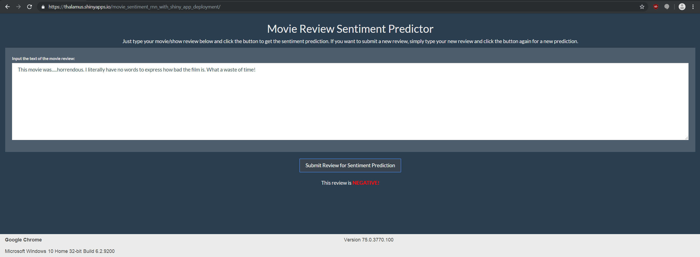
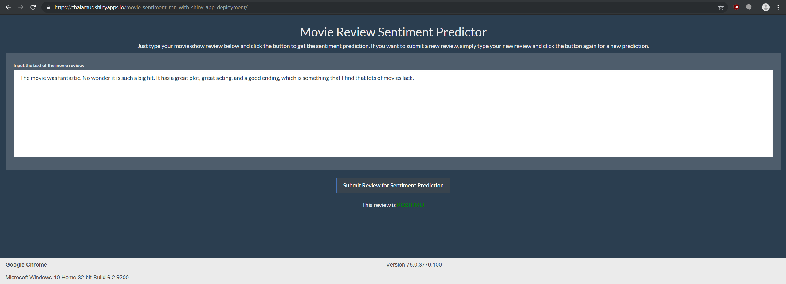

# Movie-Sentiment-RNN-with-Shiny-App-Deployment
Background Code behind my deployed R Shiny app located at https://thalamus.shinyapps.io/Movie_Sentiment_Detector/ containing an LSTM model capable of predicting the sentiment of movie reviews. A couple examples of how this app works can be seen below:

The first folder contains the code which I used to actually deploy the R Shiny app in www.shinyapps.io. To obtain the best-performing sentiment model that goes along this code in the R Shiny app see: https://drive.google.com/open?id=1g4zOfEiGDUGWJm4mUz5V0xGl8WlF_BV2

The second folder above represents the orginal code that I used to build and test the app locally in my computer. This includes the training of the LSTM model and the testing with a separate test set that yielded an 88% test accuracy. If you want to run this app locally, I suggest that you use the files in this folder and then obtain the "Sentiment_Best_Model.pt" file from this link https://drive.google.com/open?id=1g4zOfEiGDUGWJm4mUz5V0xGl8WlF_BV2. After that, just run "Movie_Review_Sentiment_Predictions_App.R" inside RStudio and you should be good to go!

Please be advised, it may take a few seconds for the Shiny app to load once you click on the URL above, and, once you type a movie review, to give the first prediction. If anyone notices any errors, please let me know, so I can fix them. It would be much appreciated!
